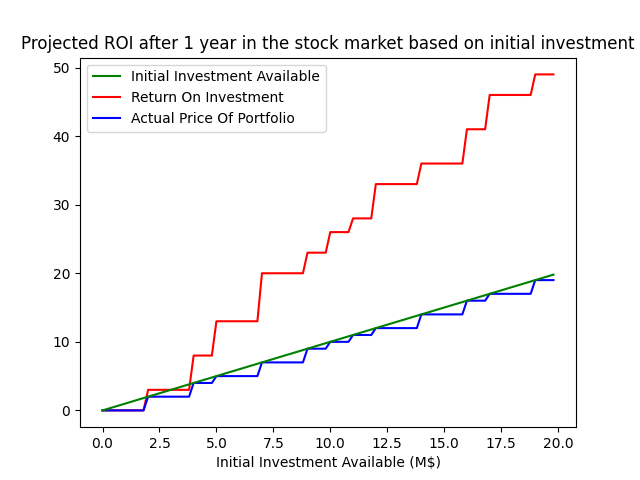

# MNIT Investment

> The code in this repository was created for the __Python for Engineers__
> session of 2020 of the MNIT university. It is used as a simple example to
> illustrate some good practices in Python.

Investment is a python package to help optimize investment on a (simplified)
stock market. The tool will use a database of stocks with their prices, expected
ROI after one year and name of their company to draw an investment curve for a
range of initial investements.



# Usage

After downloading the code, the tool can be installed with pip:

```bash
# When in the directory containing the "setup.py" file.
python3 -m pip install .
# Short form
pip3 install .
```

To use the tool, one first need a database of stocks in the json format. An
[example database](test/files/stock_database.json) can be found in the
repository.

Then, to use the tool, decide the range for which you want to plot your
investment curve, the run:

```bash
# Long form
python3 -m investment --stock_database stock_database.json start stop
# Short form, the database file is assumed to be "stock_database.json"
investment start stop
```

The code was tested on a [debian](https://debian.org) (GNU/Linux) system running
[python 3.9](https://www.python.org/downloads/release/python-390/).

# Development

__Optional__

Before perfomring the following steps, one may want to create a virtual
environment dedicated to the project. See the
[virtualenv](https://pypi.org/project/virtualenv/) package.

To set up the development environment to work on the package, a
[requirements.txt](requirements.txt) file is provided. To use it, run:

```bash
# Long form
python3 -m pip install -r requirements.txt
# Short form
pip3 install requirements.txt
```

To run the tests for the package, the [tox](https://pypi.org/project/tox/) tool
can be used with the provided [tox.ini](tox.ini) file. Simply run `tox` when in
the directory containing the tox.ini file.

## Code Structure

The __structure of the repository__ is as follows:

Directory | Content
--------- | -------
[investement](investment) | Holds the source code for the investment package
[test](test) | Holds the source code for the tests of the package
[doc](doc) | Holds some files used to build the documentation

The __structure of the source code__ (within the investment directory) is as
follows:

Source File | Content
----------- | -------
[\_\_init\_\_.py](investment/__init__.py) | Used by Python to make the package importable
[investor.py](investment/investor.py) | Optimizes the Portfolio based on a Stock market and an initial investment
[main.py](investment/investor.py) | Command line interface of the package
[plotter.py](investment/plotter.py) | Draws and saves the investment plot based on provided results
[portfolio.py](investment/portfolio.py) | Internal class representing a Portfolio of Stocks
[stock.py](investment/stock.py) | Internal class representing a single Stock

## Additional Links

The __Style Guide for Python Code__ was written in [PEP 8](https://www.python.org/dev/peps/pep-0008/). It details how Python code should be written, what naming conventions should be followed etc...

### METADATA

Field | Value
--- | ---
:pencil: Contributors | roadelou
:email: Contacts | 
:date: Creation Date | 2020-12-16
:bulb: Language | Markdown Document

### EOF
